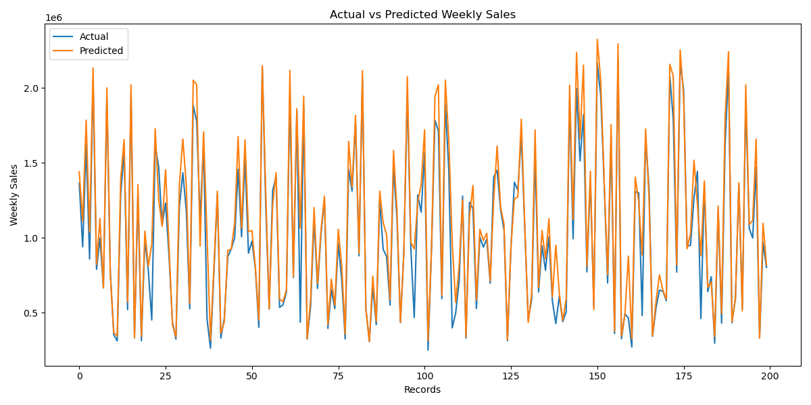
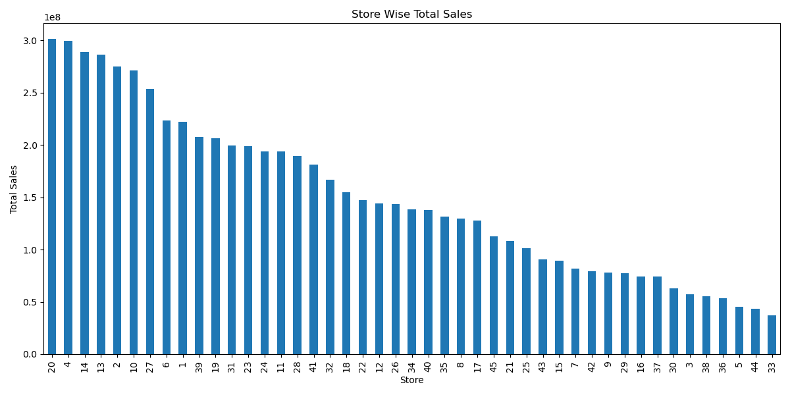
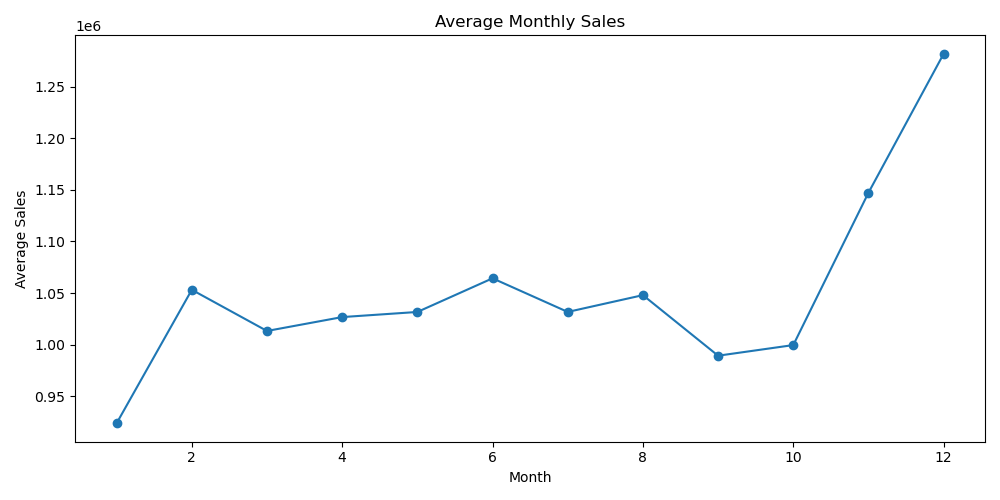

# Walmart Sales Forecasting

## Overview

This project uses Machine Learning to forecast Walmart weekly sales using historical sales records and economic indicators.

The objective is to analyze sales patterns and build a predictive model that helps in business decision-making and inventory planning.

---

## Dataset Features

- Store
- Date
- Weekly_Sales
- Holiday_Flag
- Temperature
- Fuel_Price
- CPI
- Unemployment

---

## Technologies Used

- Python
- Pandas
- NumPy
- Matplotlib
- Scikit-Learn

---

## Machine Learning Model

**Random Forest Regressor**

The model predicts weekly sales based on store information, date features, and economic indicators.

---

## Project Structure

```text
FUTURE_ML_01
│
├── data
├── outputs
├── screenshots
├── insights
├── main.py
├── README.md
└── requirements.txt
```

---

## Results

### Actual vs Predicted Weekly Sales



---

### Store-wise Sales Analysis



---

### Monthly Sales Trend



---

## Model Performance

| Metric | Value |
|----------|----------|
| MAE | 98,093.53 |
| RMSE | 175,968.11 |
| R² Score | 0.8910 |

---

## Key Insights

- Identified top-performing stores.
- Analyzed monthly sales trends.
- Studied the impact of holidays on sales.
- Forecasted weekly sales using Machine Learning.
- Generated business recommendations based on data analysis.

---

## Installation

```bash
pip install -r requirements.txt
```

---

## Run the Project

```bash
python main.py
```

---

## Outputs Generated

- Metrics Report
- Actual vs Predicted Sales Visualization
- Store-wise Sales Analysis
- Monthly Sales Trend Analysis
- Business Insights Report

---

## Conclusion

This project demonstrates the application of Machine Learning in retail sales forecasting and highlights how predictive analytics can support data-driven business decisions.

## Overview

This project uses Machine Learning to forecast Walmart weekly sales using historical sales records and economic indicators.

The objective is to analyze sales patterns and build a predictive model that helps in business decision-making and inventory planning.

---

## Dataset Features

- Store
- Date
- Weekly_Sales
- Holiday_Flag
- Temperature
- Fuel_Price
- CPI
- Unemployment

---

## Technologies Used

- Python
- Pandas
- NumPy
- Matplotlib
- Scikit-Learn

---

## Machine Learning Model

**Random Forest Regressor**

The model predicts weekly sales based on store information, date features, and economic indicators.

---

## Project Structure

```text
FUTURE_ML_01
│
├── data
├── outputs
├── screenshots
├── insights
├── main.py
├── README.md
└── requirements.txt
```

---

## Results

### Actual vs Predicted Weekly Sales


---

### Store-wise Sales Analysis


---

### Monthly Sales Trend


---

## Key Insights

- Identified top-performing stores
- Analyzed monthly sales trends
- Studied the impact of holidays on sales
- Forecasted weekly sales using Machine Learning
- Generated business recommendations based on data analysis

---

## Installation

```bash
pip install -r requirements.txt
```

---

## Run the Project

```bash
python main.py
```

---

## Outputs Generated

- Sales Forecast Metrics
- Actual vs Predicted Sales Chart
- Store-wise Sales Analysis
- Monthly Sales Trend Analysis
- Business Insights Report

---

## Conclusion

This project demonstrates the application of Machine Learning in retail sales forecasting and highlights how predictive analytics can support data-driven business decisions.